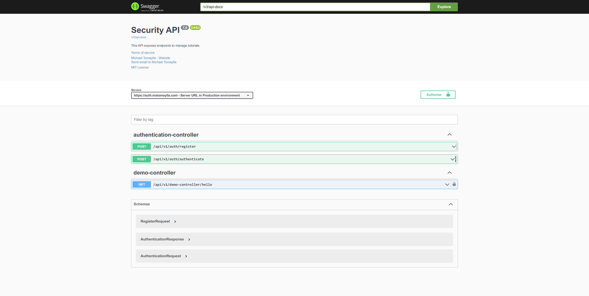

# Security API - code component solution

This is a Security API using Spring Boot 3.0 and JSON Web Tokens (JWT)  

## Table of contents

- [Overview](#overview)
  - [Screenshot](#screenshot)
  - [Links](#links)
- [My process](#my-process)
  - [Built with](#built-with)
  - [Installation](#installation)
- [Author](#author)


## Overview

### Screenshot



### Links

- Solution URL: [https://github.com/darkmtrance/security-api](https://github.com/darkmtrance/security-api)
- Live Site URL: [https://auth.matomaylla.com/swagger-ui/index.html](https://auth.matomaylla.com/swagger-ui/index.html)

## My process

### Built with

- [Springboot v3] (https://spring.io/projects/spring-boot)
- [Swagger] (https://swagger.io/) - API docs
- [JSON Web Tokens] (https://jwt.io/) - JWT
- [Spring Security] (https://docs.spring.io/spring-security/reference/index.html)
- [Mapstruct] (https://mapstruct.org/)
- [Gradle] (https://gradle.org/)
- [JDK 17+] (https://learn.microsoft.com/es-es/java/openjdk/download)


### Installation

```bash
git clone https://github.com/darkmtrance/security-api.git
cd security-api
```

add Environment Variables:
```bash
spring.datasource.url=${DATABASE_URL}
spring.datasource.username=${DATABASE_USER}
spring.datasource.password=${DATABASE_PASSWORD}
##Modify to false
scheduling.enabled=false
```
or change the values `${DATABASE_URL}` , `${DATABASE_USER}` and `${DATABASE_PASSWORD}` with the MYSQL connection string.

run app

```bash
./gradlew bootRun
```


## Author

- Website - [Michael Tomaylla](https://cv.matomaylla.com/)
- Linkedin - [@matomaylla](https://www.linkedin.com/in/mtm2019/)
